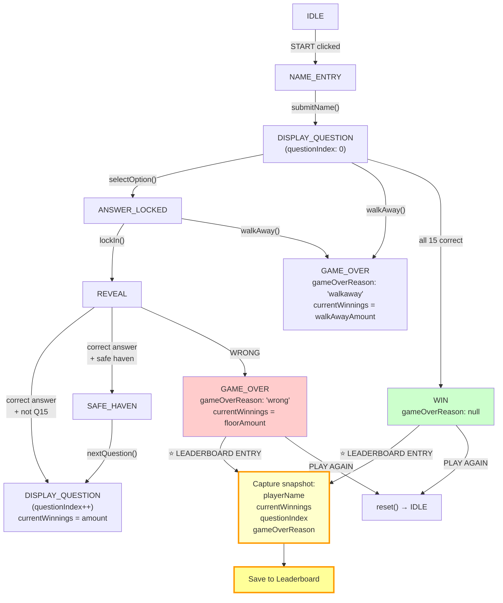
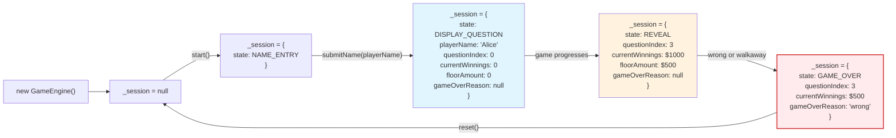
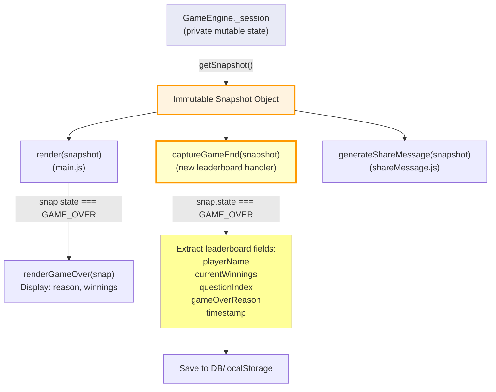

# ADR 017: Persistent Scores & Local Leaderboard

**Status:** Proposed

**Context:** 
Current state (ADR-005) stores session in memory. Scores lost on refresh. No way to review past performance or share results with context (score, questions reached, lifelines used). Players want retention mechanics and bragging rights.

**Decision:** 
Store game sessions in browser `localStorage` as JSON array. Each session object: `{ id, timestamp, playerName, finalScore, questionsReached, lifelinesUsed, difficulty }`. Leaderboard displays top 10 local scores. Share button generates text+emoji snapshot (e.g., "🎬 Reached Q12 for $1M! 📺 Beat me?").

**Consequences:**

*Positive:*
- Improved retention—players see history, motivation to beat personal best.
- Zero backend; no cross-device sync needed (user asks for local-only).
- Social share low friction—copy emoji+text to clipboard or paste to social.
- localStorage ~5–10 MB per domain; 100 sessions ~10 KB easily fits.

*Negative:*
- Not synced across devices/browsers (user accepted).
- localStorage cleared if user clears browser data.
- Leaderboard privacy: all scores visible to anyone with browser access (acceptable for single-player casual game).
- Share format low-fidelity (text/emoji, not image card).

**Implementation Notes:**
- Persist session after game-over state transition.
- Leaderboard UI: sort by score desc, show rank + player name + score + date.
- Share: format as `"🎬 [name] | Q[num] | $[score] | [date]"`, copy to clipboard.
- Clear leaderboard: optional settings menu entry.

**Related ADRs:**
- ADR-005 (In-Memory Session State) — supersedes for local history; main session still in-memory during gameplay.
- ADR-003 (FSM) — persist on GAME_OVER state.

## State Machine Flow → Leaderboard

---

## Session Object Lifecycle

---

## Snapshot Flow (for UI & Leaderboard)

